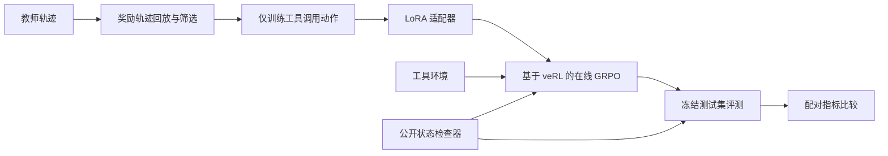

# Shopping Agent Post-Training

<div align="center">

**面向长程工具调用智能体的可审计后训练工具箱**

只训练工具调用动作 · 在线 GRPO · 公开状态检查 · 有条件的实验晋级

<br />

[](pyproject.toml)
[](https://github.com/volcengine/verl)
[](https://github.com/vllm-project/vllm)
[](https://github.com/go99further/shopping-agent-posttraining/actions/workflows/tests.yml)
[](https://github.com/go99further/shopping-agent-posttraining/stargazers)
[](LICENSE)

[完整端到端项目](https://github.com/YYHDBL/shopping-grpo-longhorizon) · [文字版说明](https://yyhdbl.github.io/)

<sub>阅读路径：<a href="#项目速览">项目速览</a> · <a href="#方法概览">方法概览</a> · <a href="#实验结果">实验结果</a> · <a href="#快速开始cpu-开发与测试">快速开始</a> · <a href="#数据环境与公开边界">公开边界</a></sub>

</div>

> **先看这里。** 完整的 Shopping GRPO 训练、环境接入与评测项目已由
> [YYHDBL/shopping-grpo-longhorizon](https://github.com/YYHDBL/shopping-grpo-longhorizon)
> 开源；如果这条长程购物 Agent 后训练路线对你有帮助，欢迎去原仓库点一个 Star。
> 希望先了解设计动机和实验过程，也可以阅读 [文字版](https://yyhdbl.github.io/)。

购物类 Agent 的难点不在于“输出一个推荐”，而在于在多轮网页/工具交互里稳定完成：检索候选、核验证据、选择正确规格、遵守预算，并在无解时合理终止。

本仓库不试图重复一个“从数据到模型”的完整 demo。它抽取并加强其中最容易在真实 GPU 实验中失效的工程层：**如何约束过程行为、如何审计失败、以及如何让一次训练结果有资格被相信。**

它不是在线购物产品，也不包含模型权重或商品数据；而是一套可接入 ShopSimulator 风格环境的后训练、评测与实验治理实现。

> [!TIP]
> 如果你只花一分钟阅读：看下方三张能力卡片、200 题冻结评测和 `READY → ... → PROMOTED` 的实验证据链；它们分别回答**项目做什么、验证到什么、为什么可信**。

## 项目速览

| 🔎 行为层：智能体是否正确行动？ | 🧭 训练层：强化学习是否稳定运行？ | 📊 证据层：结果是否值得相信？ |
| --- | --- | --- |
| 公开状态检查器检查工具合法性、新证据、规格选择和购买就绪。 | veRL / vLLM 多轮采样，动态采样与过程信用只在训练侧提供补充信号。 | 冻结任务编号、配对汇总、失败记录与晋级条件构成可复核证据链。 |

### 核心能力

- **可执行行为的监督微调（SFT）**：仅对助手发出的工具调用动作计算损失，避免模型学习复述环境观测。
- **在线 GRPO 训练适配**：基于 `verl==0.8.0` 接入多轮智能体循环、工具定义、终局奖励回传与 vLLM 采样。
- **确定性公开状态检查器**：只读取智能体可见的观测与公开工具调用，检查非法动作、重复无进展、候选打开、规格推进和购买就绪；不读取隐藏目标或终局奖励内部细节。
- **受控实验治理**：提供运行前检查、失败重放、试运行检查和无人值守晋级状态机，避免把“进程退出码为 0”误当作实验成功。
- **可审计评测口径**：结果按固定任务编号对齐，基础模型、监督微调和 GRPO 使用同一冻结任务集比较；基础设施失败仍保留在分母中。

## 为什么还需要这个仓库？

完整项目与本仓库不是简单的重复关系：前者回答“如何完成一条购物 Agent 后训练流水线”，这里更聚焦“如何让在线 RL 运行可控、失败可解释、结果可复核”。

| 维度 | [完整端到端项目](https://github.com/YYHDBL/shopping-grpo-longhorizon) | 本仓库的差异化重点 |
| --- | --- | --- |
| 目标 | 复现基线 → 监督微调 → GRPO → 冻结 200 题测试的完整路线 | 将训练控制、过程信号与可审计运行机制模块化 |
| Agent 能力 | 搜索、详情核验、变体选择、购买/终止 | 将“是否在正确地推进任务”编码为仅依赖公开状态的 verifier |
| 在线强化学习 | veRL + vLLM 多轮采样 | 动态采样、项目实现的过程信用模块（代码名 `GraphGPO-lite` / `GiGPO-lite`）、失败重放与预注册晋级条件 |
| 实验完成定义 | 训练与评测输出结果 | `READY → RUNNING → COMPLETE/FAILED → ANALYZED → PROMOTED` 的证据链 |
| 公开内容 | 包含完整环境与数据接入说明 | 不分发受限环境、数据、权重或原始轨迹，只发布项目自有工程层 |

换句话说：这里的核心问题不是“再做一个 reward”，而是让 Agent 在看不到隐藏目标时，仍能被检查为是否在**合法地行动、获得新证据、完成必要规格选择，并避免无效循环或过早购买**。

## 方法概览



训练目标与评测目标分层处理：

| 层级 | 作用 | 边界 |
| --- | --- | --- |
| 环境终局奖励（Reward） | 判断购买/终止结果与约束满足 | 由环境定义，本项目不改写 |
| 公开状态检查器（代码模块名 `Process Verifier`） | 记录公开状态下的动作质量与过程信号 | 不访问隐藏目标，不替代环境终局奖励 |
| 轨迹评审器（代码模块名 `Trajectory Judge`） | 离线评测轨迹的策略与证据质量 | 不参与在线训练 |

## 实验结果

下表是同一冻结 200 题上的一次确定性多轮采样对比。它用于审计已完成实验，**不表示采样方差、统计显著性或线上效果**。

| 阶段 | 完成率 | 严格成功率 | 购买成功率 | 平均终局奖励 | 动作守卫拒绝数 |
| --- | ---: | ---: | ---: | ---: | ---: |
| Qwen3.5-2B 基线 | 18.0% | 0.0% | 0.0% | -0.1105 | 752 |
| LoRA SFT | 96.5% | 60.5% | 60.5% | 0.4729 | 52 |
| GRPO step 100 | 96.5% | **62.0%** | **62.5%** | **0.5158** | **38** |

<div align="center">

<sub><b>同一冻结集 · 固定分母 · 单次确定性采样 · 聚合结果可在 <a href="results/">results/</a> 核验</b></sub>

</div>

在该固定口径下，GRPO 比监督微调多 3 个严格成功任务，并减少了错误购买、循环与动作守卫拒绝。完整聚合结果见 [`results/`](results/)，评测口径见 [`docs/evaluation.md`](docs/evaluation.md)。

## 术语说明

为避免把项目内部代码名误写成行业通用算法，这里明确区分三类名称：

- **外部项目或标准名称**：`veRL`、`vLLM`、`LoRA`、`GRPO`、`Qwen3.5`、`A100` 和 `ShopSimulator` 均指向其公开项目、论文或硬件名称。
- **描述性名称**：本文所说的“公开状态检查器”是对 `process_verifier.py` 功能的中文描述；它只依据智能体能看到的状态检查动作，不是一个声称已有统一定义的行业标准组件。
- **项目内部实现名**：`GraphGPO-lite`、`GiGPO-lite` 和 `Agent-ProGRPO` 是本仓库代码与实验记录中的实现名，用于区分不同的过程信用/优势估计实现；它们不是本项目宣称的新通用算法，也不代表上游论文的原样复现。`Final-200` 在文档中仅表示“固定的 200 道测试任务”，不表示新的模型或算法。

README 中保留英文，主要是为了与代码目录、依赖包和公开论文保持可检索的一致性；第一次出现时均给出中文解释。

## 核心模块

```text
src/shopping_grpo/
├── collection/             # 教师轨迹采集与工具调用动作数据构建
├── environment/            # 工具、观测、动作与上下文适配
├── evaluation/             # 轨迹规范化、配对比较、评测契约与工件校验
└── training/
    ├── sft/                # LoRA SFT 数据集处理
    └── grpo/               # veRL 适配层、GRPO 及项目内部过程信用实现
        ├── adapter/        # 智能体循环、会话与工具桥接
        ├── process_verifier.py
        ├── dynamic_sampling.py
        ├── graphgpo.py
        └── gigpo.py

scripts/                    # 采集、训练、环境检查、评测与晋级控制器
configs/                    # 智能体循环、工具、GRPO 与实验契约
patches/                    # 有版本与 SHA 约束的窄范围 veRL 兼容补丁
tests/                      # 无专有环境即可执行的公开单元测试
results/                    # 聚合指标；不含原始轨迹和任务数据
docs/                       # 监督微调、GRPO、奖励与评测设计说明
```

## 快速开始：CPU 开发与测试

公开仓库提供了不依赖 GPU、模型权重或 ShopSimulator 数据的单元测试。建议使用 Python 3.10+：

```bash
git clone https://github.com/go99further/shopping-agent-posttraining.git
cd shopping-agent-posttraining

python -m venv .venv
.venv/bin/pip install --upgrade pip
.venv/bin/pip install -e . pytest

PYTHONPATH=.:src .venv/bin/python -m pytest -q \
  tests/test_action_validation.py \
  tests/test_dataloader_lifecycle.py \
  tests/test_experiment_config.py \
  tests/test_process_verifier.py \
  tests/test_unattended_promotion_controller.py
```

当前公开测试集结果为 **38 passed**。GitHub Actions 会在 push 和 pull request 时执行同一组测试。

## GPU 训练环境

完整 GRPO 运行需要 Linux + NVIDIA CUDA。已验证的参考组合为：

| 组件 | 版本 |
| --- | --- |
| Python | 3.10 |
| PyTorch | 2.10.0 + cu128 |
| veRL | 0.8.0 |
| vLLM | 0.17.0 |
| GPU | NVIDIA A100 80 GB |

安装 GRPO extra 后，先做运行时检查，再仅查看解析后的训练命令：

```bash
pip install -e '.[grpo]'
PYTHONPATH=.:src python scripts/check_grpo_runtime.py
PYTHONPATH=.:src python scripts/train_grpo.py --dry-run
```

训练需要由使用者提供环境服务、数据路径和模型路径。`configs/grpo.yaml` 通过环境变量显式绑定这些外部资源，避免将机器路径或凭证硬编码进代码。请先阅读 [`docs/grpo.md`](docs/grpo.md) 与 [`docs/versioning.md`](docs/versioning.md)。

## 受控运行与失败恢复

GPU 实验不应覆盖旧目录或凭“进程退出”直接晋级。本项目的控制器使用如下状态流转：

```text
READY → RUNNING → COMPLETE / FAILED → ANALYZED → PROMOTED
```

- 运行前检查提交版本、数据/配置哈希、可执行文件、磁盘、端口与 GPU 资源；
- `COMPLETE` / `FAILED` 只能来自预注册 marker，不信任孤立的 exit code；
- 停滞 heartbeat 只冻结对应分支，避免错误推进；
- 新尝试必须使用新的 run ID，失败目录作为证据保留；
- `PROMOTED` 要求完成标记和全部预注册分析条件均通过。

示例 manifest 见 [`configs/unattended_promotion.example.json`](configs/unattended_promotion.example.json)，控制器入口为：

```bash
PYTHONPATH=.:src python scripts/unattended_promotion_controller.py --help
```

## 数据、环境与公开边界

为尊重上游许可和实验数据边界，本仓库**刻意不分发**：

- ShopSimulator 源码快照、商品目录、检索索引和私有 TaskFacts；
- 教师原始轨迹、训练/验证 JSONL 或 Parquet、模型权重与 checkpoint；
- 原始采样轨迹、运行日志、API 凭证、服务器地址和机器专属启动记录。

`results/` 只保留可读的聚合统计。若要复现完整流程，请从数据与环境权利方按其原始许可证和条款获取依赖；详细规则见 [`PUBLIC_DATA_POLICY.md`](PUBLIC_DATA_POLICY.md)。

## 贡献与开发原则

欢迎围绕可审计性和可复现性提交改进。提交前请确保：

1. 不提交 token、密钥、模型权重、环境数据或运行日志；
2. 新实验附带配置、输入哈希、代码提交与失败判定口径；
3. 不用隐藏目标、真实终局奖励细节或大语言模型评审结果塑造过程奖励；
4. 新增行为应有公开可运行的测试或最小复现。

## 致谢

- [veRL](https://github.com/volcengine/verl)：在线 RL 与 Agent 训练框架；
- [vLLM](https://github.com/vllm-project/vllm)：高吞吐多轮采样推理；
- [ShopSimulator](https://github.com/ShopAgent-Team/ShopSimulator)：本项目评测所对接的上游购物 Agent 环境。

本仓库仅发布项目自有的适配、训练、评测与实验治理代码；不再分发上述上游环境或数据。

## License

[MIT](LICENSE)，仅适用于本仓库发布的项目自有代码；外部依赖、环境与数据仍遵循其各自许可证和使用条款。
